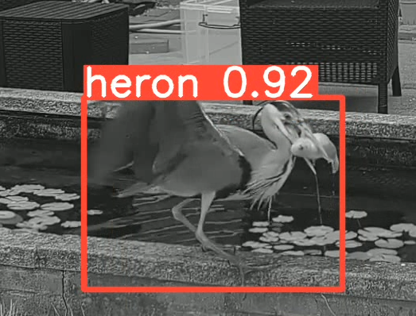

# Heron Tracker



Heron Tracker is a Python application designed to automate the monitoring of herons through image data processing and real-time streaming capabilities.

## Features:

- Image Data Processing: Using image polling
- Real-Time Streaming: Supports RTSP (Real-Time Streaming Protocol)

## Setup:

1. Environment Setup: Initialize a Python virtual environment and activate it to ensure all dependencies are isolated.

```
python3 -m venv venv
source venv/bin/activate
```

2. Dependency Installation: Install all required Python packages using the provided requirements file to ensure the application runs smoothly.

```
pip install -r requirements.txt
```

3. Configuration: Set up necessary environment variables including endpoints for image data processing or RTSP stream URLs.

```
ENDPOINT=<endpoint to call with image data>
STREAM_URL=<url for RTSP stream>
IMAGE_ENDPOINT=<url to post image>
```

## Usage:

- Polling Script: Periodically test and fetch data using the `periodically_test.py` script to keep track of changes or movements.
- Streaming Script: Utilize the `rtsp_stream_test.py` script to start and manage real-time video streams from configured sources.

Run polling script

```
python polling_image_test.py
```

Run streaming script

```
python rtsp_stream_test.py
```

### Node Red

I use this with node red to trigger a notification using [ntfy.sh](https://ntfy.sh) and other automations. I've included a sample flow in `./sample_flow`